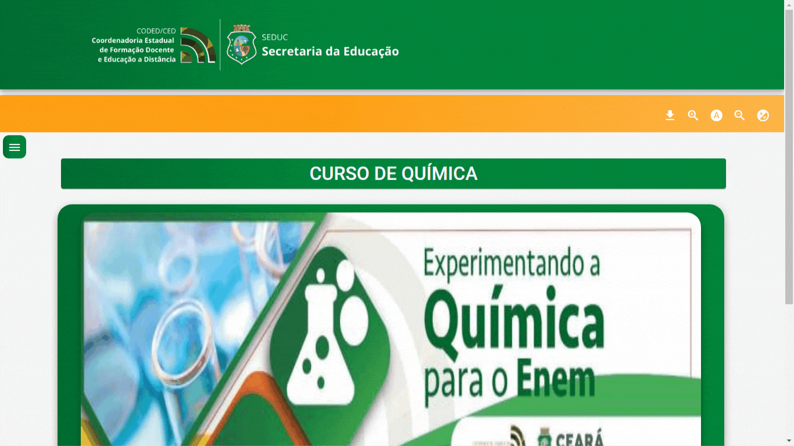

<h1 style="width:150px">
    
<h1>

<h1 style="width:400px; margin-top:-60px">
    
<h1>

# Sobre
O projeto **NEXUS - Plataforma de conexão** foi desenvolvido com o intuito de desenvolver habilidades e conhecimentos a cerca de de linguagens de programação.

---

# Ferramentas utilizadas
- HTML 
- CSS 
- Angular 
- Typescript 

---

# Como instalar o projeto em sua máquina

``` bash
#Clonar  o repositório
$git clone https://github.com/emsalves/Projeto_Nexus.git

#Entrar  o repositório
$cd Projeto_Nexus
``` 