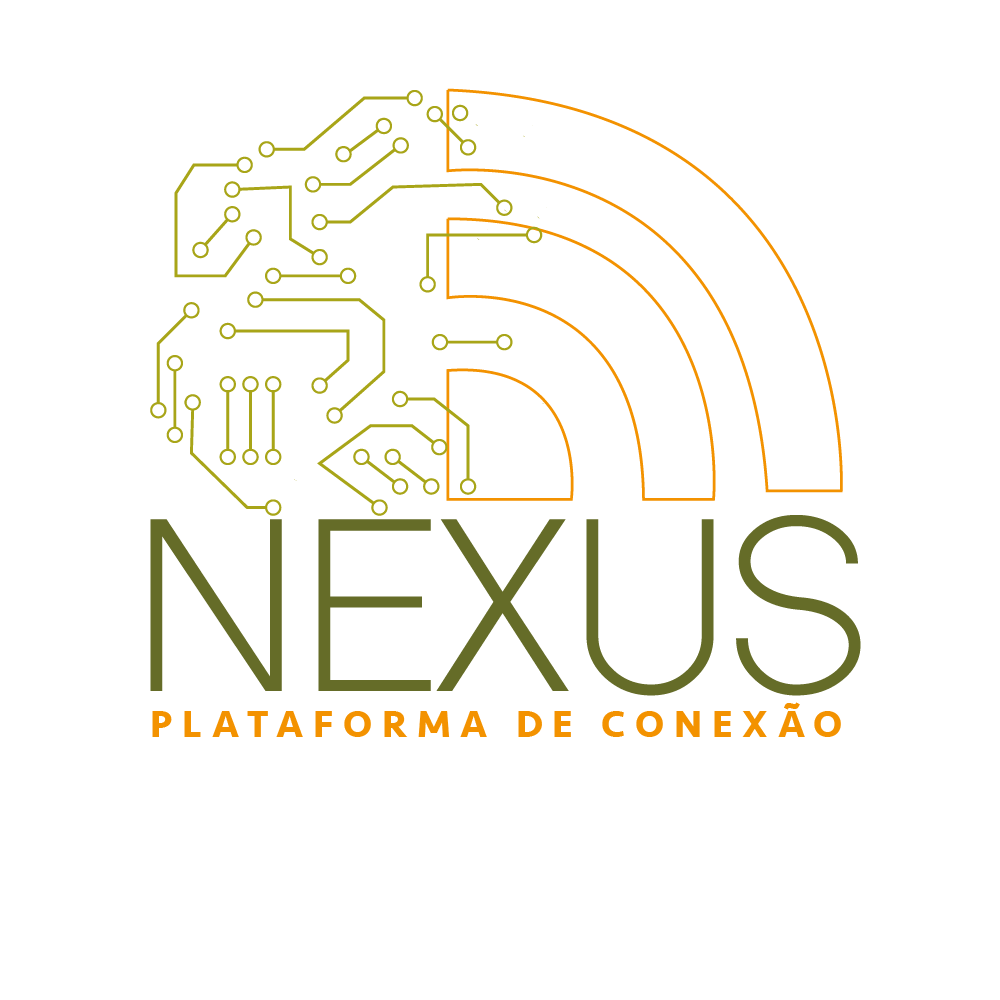

    
# Sobre
O projeto **NEXUS - Plataforma de conexão** foi desenvolvido com o intutito de desenvolver e aprimorar as habilidades em diferentes linguagens de programação voltadas para criação de uma SPA (Single Page Application).


# Ferramentas utilizadas
- HTML 
- CSS 
- Angular 
- Typescript 


# Como instalar o projeto em sua máquina

``` bash
#Clonar  o repositório
$git clone https://github.com/emsalves/Projeto_Nexus.git
``` 
